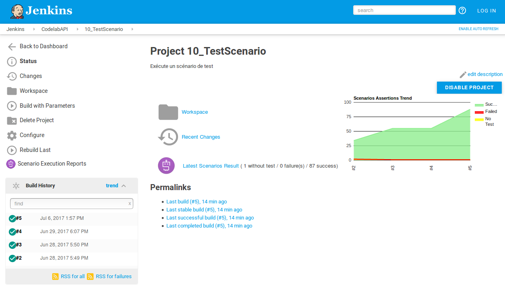
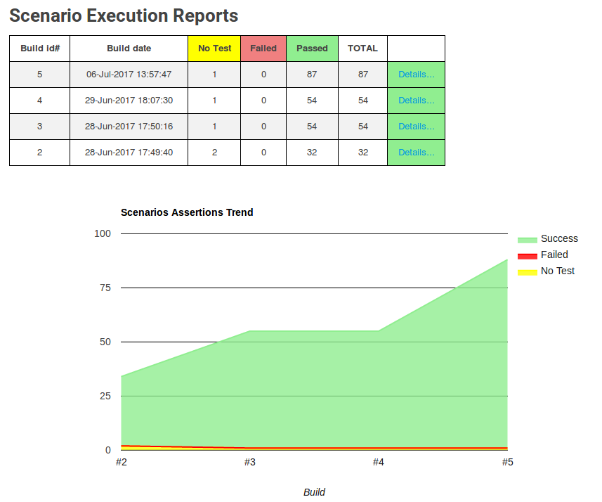
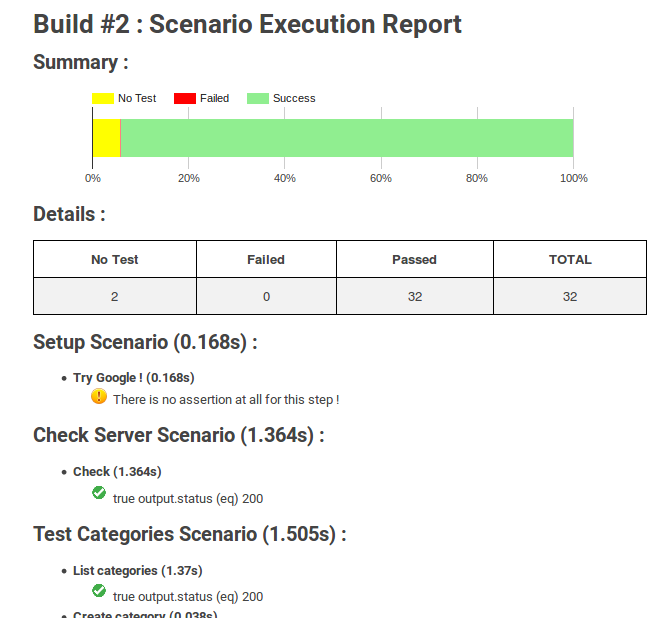

# Description

Publish report and statistics after Stoplight/Scenario execution through Prism. See https://help.stoplight.io/scenarios/conducting-scenarios-outside-of-stoplight/running-scenarios

This Jenkins plugin is used as "Post Built Action".

# Usage

## Build

    mvn package

## Installation

The plugin can be install with the differents methods described in the Jenkins documentation : https://wiki.jenkins.io/display/JENKINS/Plugins#Plugins-Howtoinstallplugins

# Features

* Graphical representation based on Google Chart 
* Integration in Jenkins menus
* Support of new Jenkins Pipeline
* Manage Prism Console LOG and JSON format

## Configuration
The plugin is able to parse either JSON format or standard output of Prism (compliant with prism-2.0.0-alpha.7).
Choose "Jenkins default console" or "File".

## Use in Jenkins Pipeline
This plugin is compliant with new Jenkins Pipeline :

    ...
    ...
    post {
        always {
            //publishStoplight consoleOrFile: 'console'
            publishStoplight consoleOrFile: 'file', resultFile: "${env.WORKSPACE}/prism.log"   // Use double-quote to have env variables replacement
        }
    }        

(Tested with Jenkins 2.60.2)

## Job Main Page : trend 

## Job Main Page : history

## Report Build 

# Notes

Thanks to Stoplight.io team.

